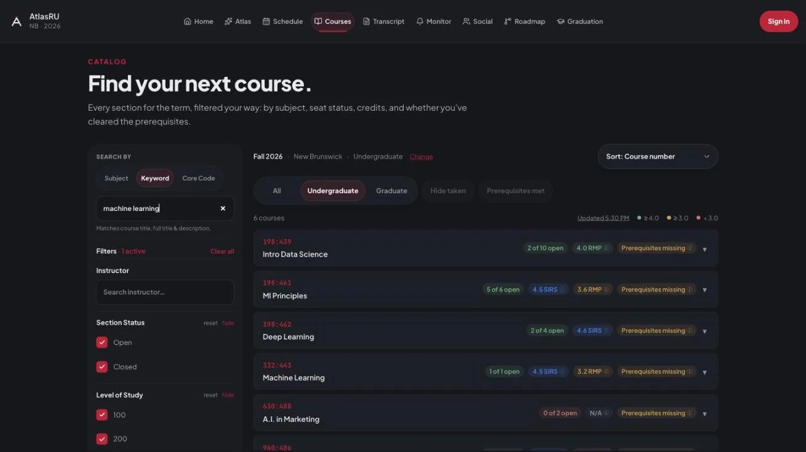
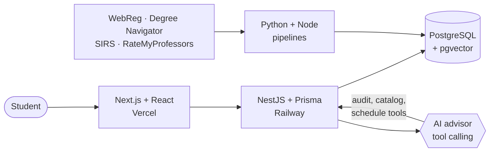

CS @ Rutgers · Prev. AI Fellow @ NJ Innovation Authority · HackRU R&D · IBM Z Student Ambassador

&nbsp;&nbsp;&nbsp;

---

## AtlasRU

Planning a Rutgers semester means bouncing between WebReg, Degree Navigator, SIRS and RateMyProfessors. [AtlasRU](https://atlasru.com) puts them in one place: live seat counts, ratings, prereqs, degree audits, a schedule generator, and an AI advisor that looks up your audit and the catalog before it answers.

| **300+** | **2,000+** | **1,800+** |
|:--:|:--:|:--:|
| students | course monitors | advisor chats |

<b>How it's built</b>

 

Things I spent way too long on:

- getting the audits to agree with Degree Navigator, down to the weird edge cases
- stopping the advisor from recommending courses you can't take yet. Prompting didn't fix it, so the check lives in code now
- turning bugs real students hit into replay tests so they stay fixed

The code is private for now. Happy to walk through it.

---

## On GitHub

| | | |
|:--|:--|:--|
| [**eufy-controller-bridge**](https://github.com/hassan1brahim/eufy-controller-bridge) | drive a robot vacuum with a PS5 controller | Python · MQTT |
| [**HackRU**](https://github.com/HackRU/frontendv2/pulls?q=is%3Apr+author%3Ahassan1brahim+is%3Amerged) | Rebuilt the Fall 2026 landing page for 600+ hackers (yes, including the mushroom cursor), then went into the backend and [fixed bugs](https://github.com/HackRU/HackRU-Backend/pulls?q=is%3Apr+author%3Ahassan1brahim+is%3Amerged) | Next.js · AWS Lambda |
| [**Job Ops**](https://github.com/hassan1brahim/codex-job-ops-template) | my internship search pipeline | Python · LaTeX |
| [**ticket-classification-gh-action**](https://github.com/newjersey/ticket-classification-gh-action) | ticket classifier I built at NJIA | Python · ML |

Experience, more projects and my resume are on my **[portfolio](https://hassan-portfolio-mhassanibrahim123-3130s-projects.vercel.app)**.

---

  

<picture>
  <source media="(prefers-color-scheme: dark)" srcset="https://raw.githubusercontent.com/hassan1brahim/hassan1brahim/output/snake-dark.svg" />
  
</picture>

